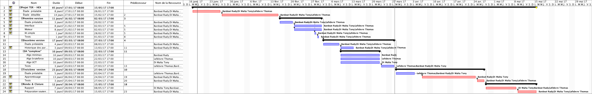

# Feuille de route TER - HEX
___

## Nom du groupe

### **RTT**

## Informations membres
- Rudy BARDOUT : [rudybardout@orange.fr](rudybardout@orange.fr)
- Tony DI MALTA : [tony.di-malta@etu.umontpellier.fr](tony.di-malta@etu.umontpellier.fr)
- Thomas LEFEBVRE : [thomas.lfbvr@gmail.com](thomas.lfbvr@gmail.com)

-> Pas de changements depuis affectation.

## Documents à lire dans le cadre du TER

- *Lessons in Play* - Michael H. Albert, Richard J. Nowakowski David Wolfe
- *Combinatorial Game Theory* Aaron N. Siegel

## Répartition des lectures et des rôles/tâches dans le groupe

Après étude de la table des matières de chacun des livres proposés, nous avons extrait les chapitres paraissant les plus importants dans le cadre de notre projet. Il ne s'agit pas d'exclure la lecture du reste de l'oeuvre mais bien de se focaliser sur le plus important :

*Lessons in Play*
0. Basic Terminology
1. Basic Techniques
2. Outcomes classes
4. The Algebra of Games
5. Value of Games
8. Hot Games
9. (w.) Further Directions (jusqu'au point 4)

*Combinatorial Game Theory*
1. Combinatorial Games
2. Short Games
3. The Structure of G
4. Impartial Games

Etant donnée l'importance pour chacun de maitriser une base commune de la théorie des jeux combinatoires, il nous parait difficile de répartir la lecture de ces chapitres et des oeuvres sus-nommées.

## Diagramme de Gantt prévisionnel

(Zoomer ou consulter le document externe)

La répartition des tâches n'est pas indiquée explicitement ici (sauf pour la partie IA complexe), chacun est assigné à toutes les tâches indiquées mais on pourra (et devra) évidemment les décomposer au fur et à mesure pour distribuer le travail plus efficacement.
